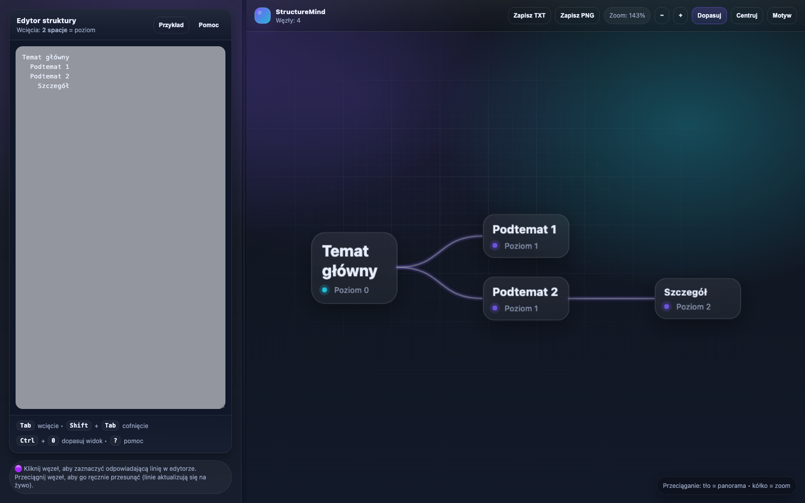

# StructureMind
Aplikacja do tworzenia map myśli w oparciu o struktury tekstowe, mieszcząca się w jednym pliku HTML. Do działania wymaga wyłącznie przeglądarki.

Wersja online: https://growdelan.github.io/StructureMind/

<div align="center">
  
</div>

## Uruchamianie

Projekt jest statyczny. Można uruchomić go bezpośrednio w przeglądarce przez `index.html` albo przez lokalny serwer:

```bash
python3 -m http.server 8000
```

Po uruchomieniu serwera aplikacja jest dostępna pod adresem `http://localhost:8000/index.html`.

## Publikacja

Aplikacja jest publikowana jako statyczna strona GitHub Pages przez workflow `.github/workflows/deploy-pages.yml`. Deployment uruchamia się po pushu na `main` oraz `codex/save`; można go też uruchomić ręcznie z zakładki Actions.
